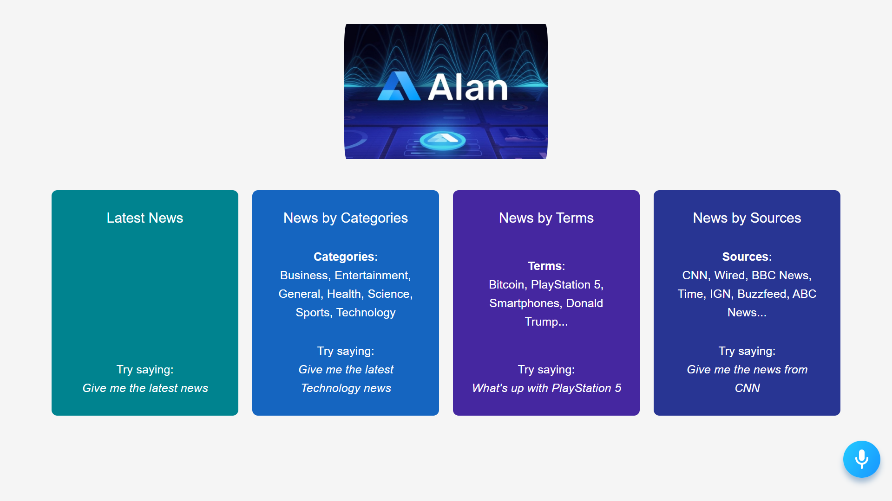

# Voice Controlled React News Application - Alan AI Voice Assistant



## Introduction
We are going to build a Conversational Voice Controlled React News Application using Alan AI. Alan AI is a revolutionary speech recognition software that allows you to add voice capabilities to your applications. It allows you to control absolutely everything in the app using your voice. Another huge benefit is that it's extremely easy to integrate it. Now you'll be able to create your own voice-controlled apps.  

Setup:
Alan Ai Setup:
- Create an Account on Alan Web: (https://alan.app/)
- Login to an Account
- Click on Create Voice Assistant button on Alan Ai Dashboard
- After Creation of Voice Assistant Click on Open Project button.
- Then Copy and Paste (https://github.com/Saiprasad16/AlanAiNewsWebApp/blob/master/alanStudio.js) into an Editor open on Alan Ai Studio Project Code.


To Run Project:
- run ```npm i && npm start``` to start development server
